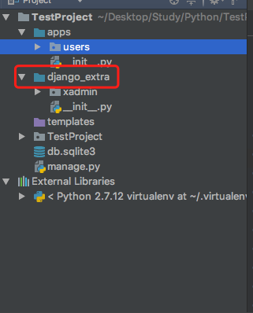
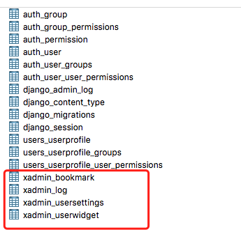
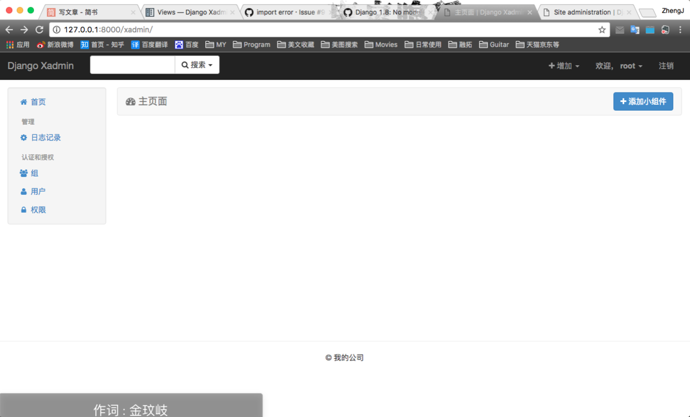
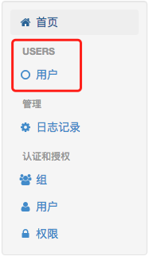
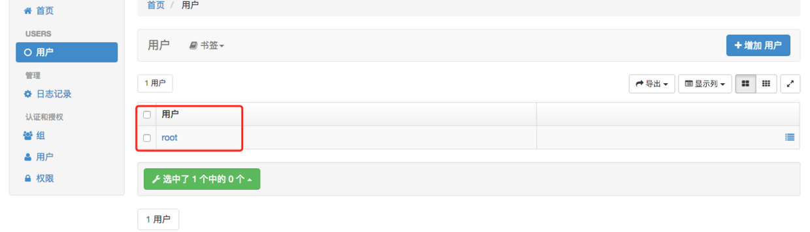
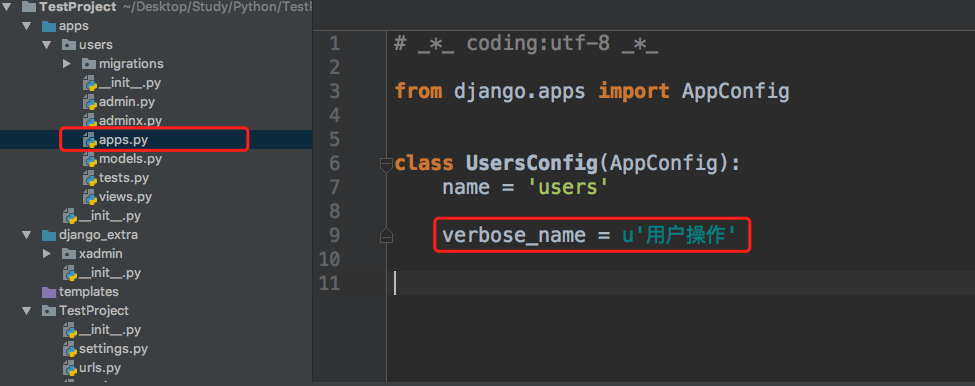
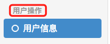
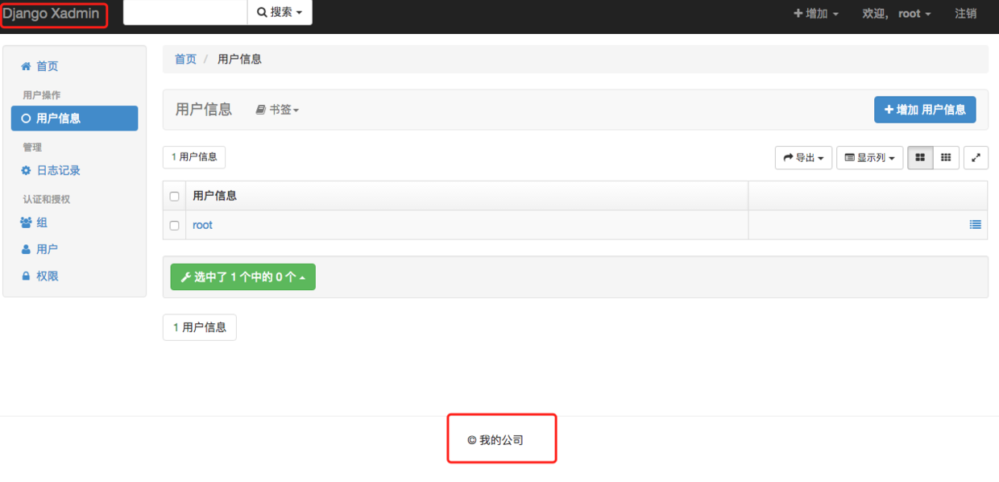
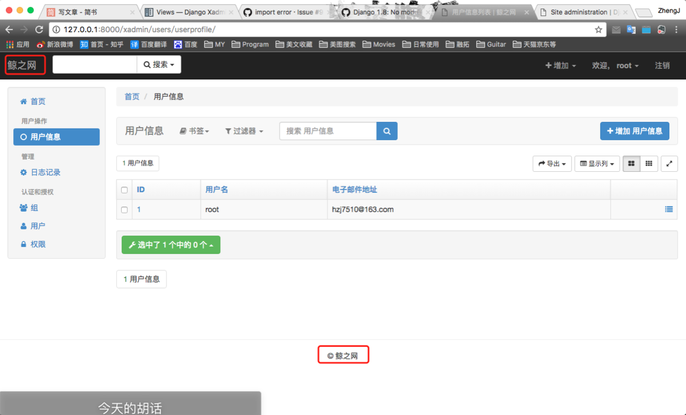
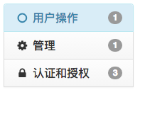

安装

通过文档我们可以发现，我们有两种方法可以进行安装。

使用pip install 安装
下载源码安装
这两种安装的区别在于
pip安装需要执行

    pip install django-xadmin
安装的版本比较旧。
源码安装，你会发现你下载的目录下有一个requirements.txt文件，你需要执行

pip install -r requirements.txt
然后将文件导入到项目中，like this

为了方便管理，我们创建了django_extra文件夹，与apps一样需要在settings中设置。
    
    import sys
    sys.path.insert(0, os.path.join(BASE_DIR, 'django_extra')

之后的操作源码跟pip操作都是一样的。

然后按照文档，我们需要将其配置到settings中的INSTALLED_APPS中

    INSTALLED_APPS = [
       ...
       ... 
       ...
        'xadmin',
        'crispy_forms',
    ]
这一步之后只需要再配置一下url就OK了
    
    import xadmin
    
    urlpatterns = [
    
    # url(r'^admin/', admin.site.urls),
    url(r'^xadmin/', xadmin.site.urls),
    ]

到此为止我们就算是配置完成了，运行一下看看效果。
    
    ProgrammingError at /xadmin/
    (1146, "Table 'newmxonline.xadmin_usersettings' doesn't exist")
    这是个什么问题？

其实到这里还没有完成，我们还需要更新一下数据库，老方法

    makemigrations
    
    migrate
我们会发现数据中多了4张表。

配置

首先我们改一下字体。
我们来到settings 中下位置可以看到这样几个参数

    LANGUAGE_CODE = 'en-us'
    TIME_ZONE = 'UTC'
    USE_I18N = True
    USE_L10N = True
    USE_TZ = True
    我们只需要将其改为
    
    LANGUAGE_CODE = 'zh-hans'
    TIME_ZONE = 'Asia/Shanghai'
    USE_I18N = True
    USE_L10N = True
    USE_TZ = False
看一下效果。

但是空空如野，我们怎么进行管理呢？

添加管理数据
这里我们需要到我们app中添加一个adminx.py的文件。注意哦，adminx.py不要输错哦。
导入 xadmin与要绑定的model,因为这里我们只有一个UserProfile model，我们就导入这一个看看效果。
    
    import xadmin
    from .models import UserProfile
    然后我们需要创建class，class命名格式最好为类名+Admin
    class UserProfileAdmin(object):
      pass
最后我们需要注册一下。
    
    xadmin.site.register(UserProfile, UserProfileAdmin)
OK，设置完成我们来看一下效果。

跟刚才比我们多了一个，users块，点开看看用户里面有什么。

是不是很眼熟，这就是我们的superuser。我们可以点击去进行管理，数据更改或者权限添加等。

有没有发现用户上面的USERS很不爽，如果是中文就好了。我们来改一下。

修改块头为中文

1.我们在apps.py中添加verbose_name = u'你想要的名字'

2.我们在__init__.py中添加

    default_app_config='users.apps.UsersConfig'
看一下效果。

添加显示字段
我们需要来到我们的adminx.py中,将我们定义的xxxAdmin修改成这样

    class UserProfileAdmin(object):
        list_display = ['id', 'username', 'email' ]  #添加要显示的列
        search_fields = ['id', 'username', 'email' ]  #要查询的列
        list_filter = ['id', 'username', 'email' ]  #要筛选的列

这两个地方有点奇怪呢，改一下。
我们在adminx.py中添加下面代码即可。

    from xadmin import views
    
    class GlobalSetting(object):
        site_title = '鲸之网'   #设置头标题
        site_footer = '鲸之网'  #设置脚标题
    
    xadmin.site.register(views.CommAdminView, GlobalSetting)
OK看一下效果。

最后一个

收缩

只需要在刚才定义的GlobalSetting中添加menu_style = 'accordion'

    class GlobalSetting(object):
        site_title = '鲸之网'   #设置头标题
        site_footer = '鲸之网'  #设置脚标题
        menu_style = 'accordion'

